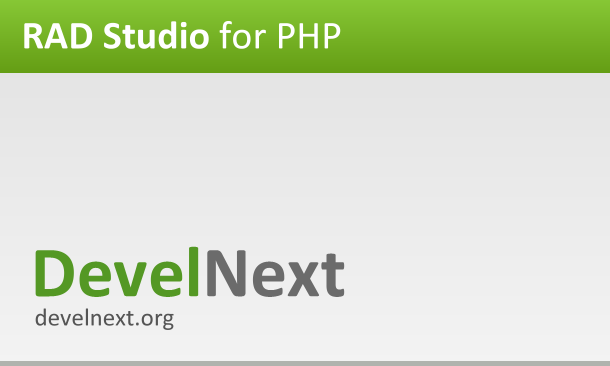

DevelNext - IDE for PHP
=======================

### How to build and start?

1. Get the sources from the JPHP repository to a directory, e.g: `path/to/jphp`.
2. Create a symlink in the directory of the DevelNext sources for the `jphp`.

and ...

Install Gradle and use the command `start`:

    gradle start

This command will start the IDE by default.
If you want open our project in IDEA, use the command `idea` to generate project files for IDEA

    gradle idea

---

### Как собрать и запустить?

1. Возьмите все исходники из JPHP репозитария и разметите их в какой-нибудь папке, например `path/to/jphp`.
2. Создайте символическую ссылку для этой директории внутри исходников DevelNext под названием `jphp`.

Установите систему Gradle и используйте его команду `start`:

    gradle start

Эта комманда запустит IDE по-умолчанию.
Если вы хотите открыть наш проект в среде IDEA, используйте команду `idea` чтобы получить проект для IDEA

    gradle idea
